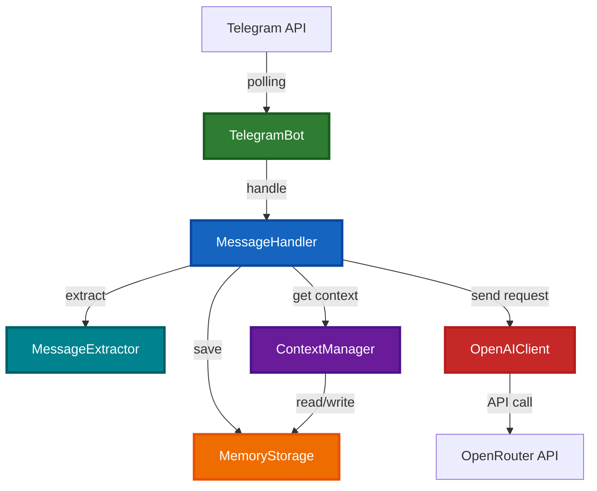
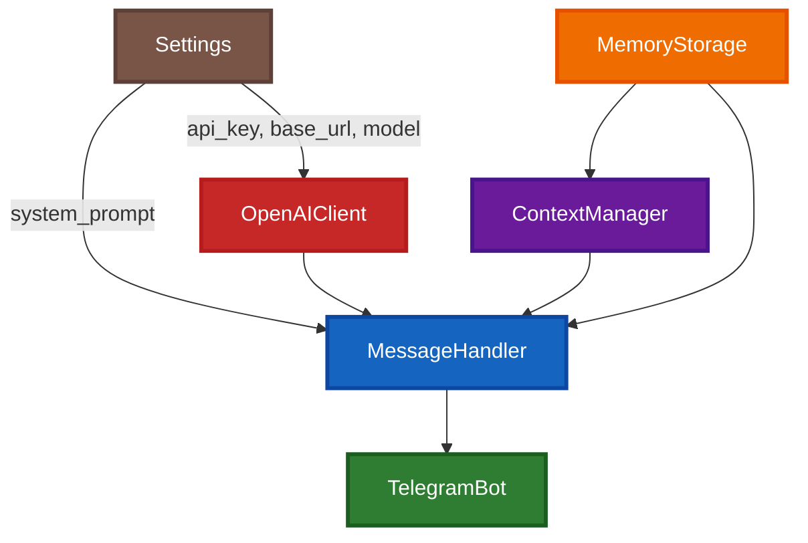
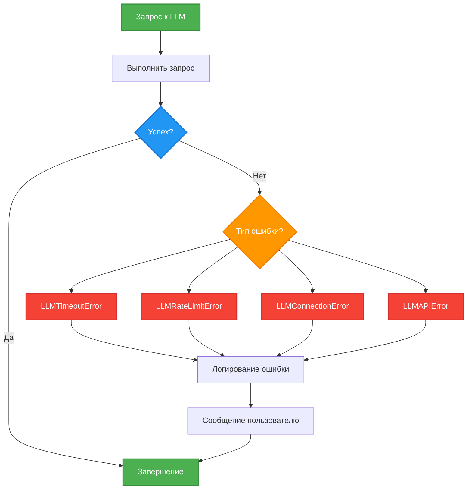

# 🏗️ Architecture Overview

Понимание архитектуры проекта за 20 минут.

## Принципы архитектуры

### KISS (Keep It Simple, Stupid)
Максимальная простота во всем. Никакого оверинжиниринга.

### SOLID
- **Single Responsibility** - каждый класс решает одну задачу
- **Open/Closed** - открыт для расширения, закрыт для изменения
- **Dependency Inversion** - зависимость от абстракций через DI

### DRY (Don't Repeat Yourself)
Нет дублирования кода. Общая логика выносится в отдельные классы.

### 1 класс = 1 файл
Строгое соблюдение. Каждый класс в отдельном файле.

### Explicit > Implicit
Явность лучше неявности. Все зависимости явно объявлены.

## Архитектура системы



## Компоненты системы

### TelegramBot
**Файл:** `src/telegram_bot.py`
**Роль:** Инициализация и запуск бота

- Регистрирует handlers для команд
- Запускает polling
- Делегирует обработку MessageHandler

### MessageHandler
**Файл:** `src/message_handler.py`
**Роль:** Координация обработки сообщений

- Обрабатывает команды (`/start`, `/help`, `/role`, `/reset`)
- Обрабатывает текстовые сообщения
- Координирует взаимодействие между компонентами
- Обрабатывает ошибки LLM

### MessageExtractor
**Файл:** `src/message_extractor.py`
**Роль:** Извлечение данных из Telegram сообщений

- Извлекает `user_id`, `chat_id`, `username`, `first_name`, `text`
- Возвращает `MessageContext` (dataclass)
- Устраняет дублирование кода (DRY)

### OpenAIClient
**Файл:** `src/openai_client.py`
**Роль:** Взаимодействие с LLM через OpenRouter

- Async метод `send_message()`
- Синхронный OpenAI client обернут в `run_in_executor`
- Обрабатывает ответы LLM
- Бросает кастомные исключения при ошибках

### ContextManager
**Файл:** `src/context_manager.py`
**Роль:** Управление контекстом диалога

- Добавляет сообщения в историю
- Ограничивает контекст (max 10 сообщений)
- Форматирует контекст для LLM
- Очищает историю по запросу

### MemoryStorage
**Файл:** `src/memory_storage.py`
**Роль:** In-memory хранилище данных

- Хранит пользователей (`Dict[int, User]`)
- Хранит диалоги (`Dict[int, Conversation]`)
- CRUD операции для пользователей и диалогов
- Метрики (количество пользователей, сообщений)

### Settings
**Файл:** `src/settings.py`
**Роль:** Конфигурация приложения

- Загружает переменные из `.env`
- Валидирует через pydantic
- Загружает системный промпт из файла
- Предоставляет настройки всем компонентам

## Flow обработки сообщения

```mermaid
sequenceDiagram
    participant U as User
    participant TG as Telegram API
    participant TB as TelegramBot
    participant MH as MessageHandler
    participant ME as MessageExtractor
    participant CM as ContextManager
    participant MS as MemoryStorage
    participant OAI as OpenAIClient
    participant OR as OpenRouter

    U->>TG: Отправляет сообщение
    TG->>TB: Webhook/Polling
    TB->>MH: handle_text_message()

    MH->>ME: extract(message)
    ME-->>MH: MessageContext

    MH->>MS: get_or_create_user()
    MS-->>MH: User

    MH->>CM: add_message(user)
    CM->>MS: save_conversation()

    MH->>CM: get_context()
    CM->>MS: get_conversation()
    MS-->>CM: Conversation
    CM-->>MH: messages[]

    MH->>OAI: send_message(messages)
    OAI->>OR: API request
    OR-->>OAI: LLM response
    OAI-->>MH: response text

    MH->>CM: add_message(assistant)
    CM->>MS: save_conversation()

    MH->>TB: send_message()
    TB->>TG: API call
    TG->>U: Получает ответ

    style U fill:#4CAF50,stroke:#388E3C,stroke-width:2px,color:#fff
    style MH fill:#1565C0,stroke:#0D47A1,stroke-width:2px,color:#fff
    style OAI fill:#C62828,stroke:#B71C1C,stroke-width:2px,color:#fff
    style CM fill:#6A1B9A,stroke:#4A148C,stroke-width:2px,color:#fff
    style MS fill:#EF6C00,stroke:#E65100,stroke-width:2px,color:#fff
```

## Dependency Injection

Все зависимости передаются через конструктор (DI pattern).

### Граф зависимостей



### Инициализация в main.py

```python
# 1. Settings (независимый)
settings = Settings()

# 2. OpenAIClient (зависит от Settings)
openai_client = OpenAIClient(
    api_key=settings.OPENAI_API_KEY,
    base_url=settings.OPENAI_BASE_URL,
    model=settings.OPENAI_MODEL,
)

# 3. ContextManager (независимый)
context_manager = ContextManager(max_messages=10)

# 4. MemoryStorage (независимый)
storage = MemoryStorage()

# 5. MessageHandler (зависит от всех)
message_handler = MessageHandler(
    openai_client=openai_client,
    system_prompt=settings.system_prompt,
    context_manager=context_manager,
    storage=storage,
)

# 6. TelegramBot (зависит от MessageHandler)
bot = TelegramBot(settings.TELEGRAM_BOT_TOKEN, message_handler)
```

**Преимущества:**
- Явные зависимости
- Легкое тестирование (моки)
- Слабая связанность
- Соблюдение SOLID

## Модель данных

### User
```python
@dataclass
class User:
    user_id: int              # Telegram user ID
    username: Optional[str]   # Telegram username
    first_name: str           # Имя пользователя
    created_at: datetime      # Время регистрации
    last_activity: datetime   # Последняя активность
```

### Message
```python
@dataclass
class Message:
    role: str                 # "user" или "assistant"
    content: str              # Текст сообщения
    timestamp: datetime       # Время сообщения
```

### Conversation
```python
@dataclass
class Conversation:
    chat_id: int              # ID чата
    user_id: int              # ID пользователя
    messages: List[Message]   # История сообщений (max 10)
    context: str              # Системный промпт
    created_at: datetime      # Время создания
    updated_at: datetime      # Последнее обновление
```

### MessageContext
```python
@dataclass
class MessageContext:
    user_id: int              # ID пользователя
    chat_id: int              # ID чата
    username: Optional[str]   # Username
    first_name: str           # Имя
    text: str                 # Текст сообщения
```

## Обработка ошибок

### Кастомные исключения

```python
class LLMError(Exception):
    """Базовый класс для ошибок LLM"""

class LLMConnectionError(LLMError):
    """Ошибка подключения к LLM API"""

class LLMTimeoutError(LLMError):
    """Таймаут при запросе к LLM"""

class LLMRateLimitError(LLMError):
    """Превышен лимит запросов к LLM API"""

class LLMAPIError(LLMError):
    """Общая ошибка LLM API"""
```

### Graceful degradation



Все ошибки:
1. Логируются в файл
2. Обрабатываются gracefully
3. Пользователю отправляется понятное сообщение
4. Бот продолжает работать

## Async/Await архитектура

### Принципы
- **IO операции** - всегда async
- **CPU операции** - в executor через `run_in_executor`
- **Не блокировать event loop**

### OpenAI Client

```python
class OpenAIClient:
    async def send_message(self, messages, system_prompt):
        # Синхронный OpenAI client в executor
        loop = asyncio.get_event_loop()
        response = await loop.run_in_executor(
            None,
            partial(self._sync_send_message, messages, system_prompt)
        )
        return response

    def _sync_send_message(self, messages, system_prompt):
        # Синхронный вызов OpenAI API
        response = self._client.chat.completions.create(...)
        return response.choices[0].message.content
```

**Почему так:**
- OpenAI библиотека синхронная
- `run_in_executor` делает её неблокирующей
- Event loop не блокируется
- MessageHandler может использовать `await`

## Логирование

### Структура логов

```
logs/
├── 2025-10-16.log
├── 2025-10-17.log
└── 2025-10-18.log
```

### Формат

```
timestamp|module|level|event|key1=value1|key2=value2
```

**Пример:**
```
2025-10-16 10:30:00|src.message_handler|INFO|user_message|user_id=123|chat_id=456
2025-10-16 10:30:01|src.openai_client|INFO|llm_request|model=gpt-3.5-turbo
2025-10-16 10:30:03|src.openai_client|ERROR|llm_error|type=timeout|error=Request timeout
```

### Что логируется
- Пользовательские действия (команды, сообщения)
- LLM запросы и ответы
- Ошибки с контекстом
- Метрики (users, messages)

### Что НЕ логируется
- Секреты и токены
- Полное содержимое сообщений (только метаданные)
- Персональные данные (если не критично)

## Ключевые паттерны

### Single Responsibility Principle
Каждый класс решает одну задачу:
- `TelegramBot` - только Telegram
- `MessageHandler` - только координация
- `OpenAIClient` - только LLM
- `ContextManager` - только контекст
- `MemoryStorage` - только хранение

### Dependency Injection
Все зависимости через конструктор, нет глобальных переменных.

### Separation of Concerns
- **Extraction** - MessageExtractor
- **Business Logic** - MessageHandler
- **Storage** - MemoryStorage
- **Integration** - OpenAIClient, TelegramBot

### DRY
- Константы текстов - BotMessages
- Извлечение данных - MessageExtractor
- Обработка ошибок - кастомные исключения

## Что дальше?

✅ **Вы понимаете архитектуру проекта**

Следующие шаги:
1. [Codebase Tour](04-codebase-tour.md) - детальный обзор кода
2. [Development Workflow](08-development-workflow.md) - процесс разработки
3. [Testing Guide](09-testing-guide.md) - тестирование

---

**Время выполнения: 20 минут**

