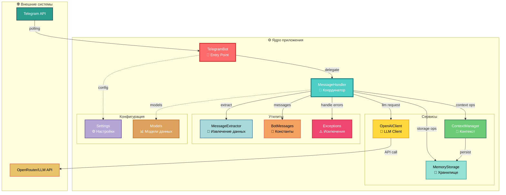
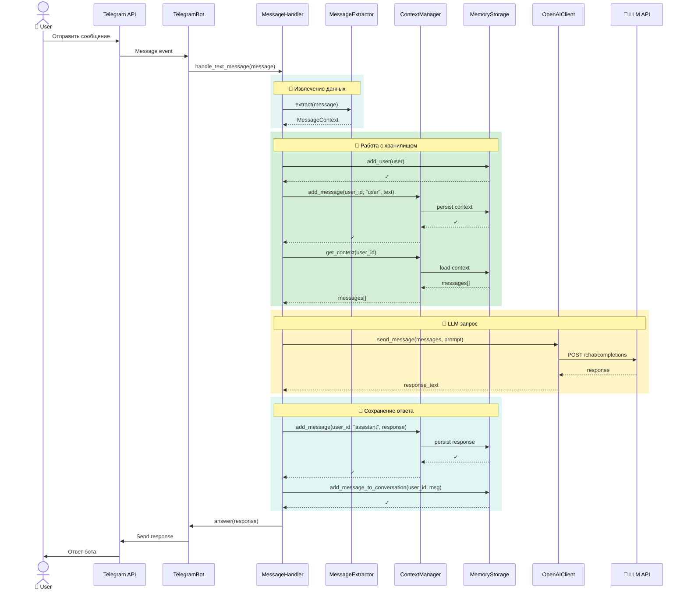
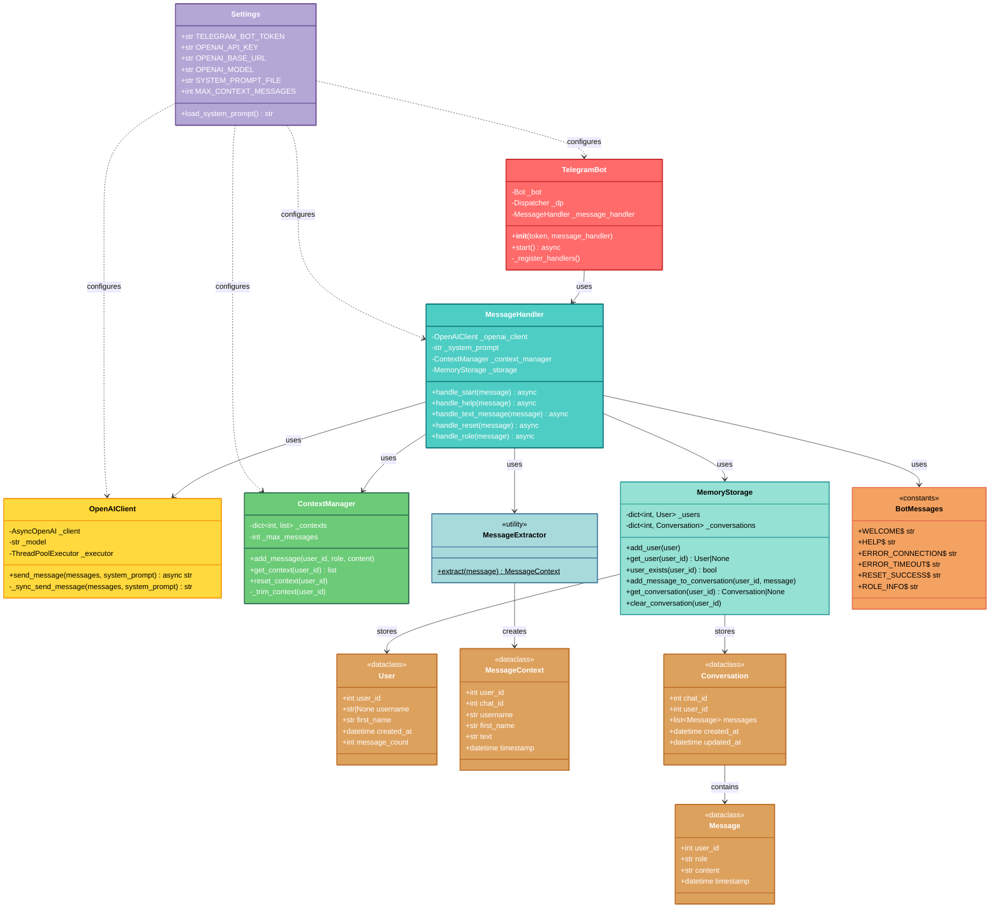
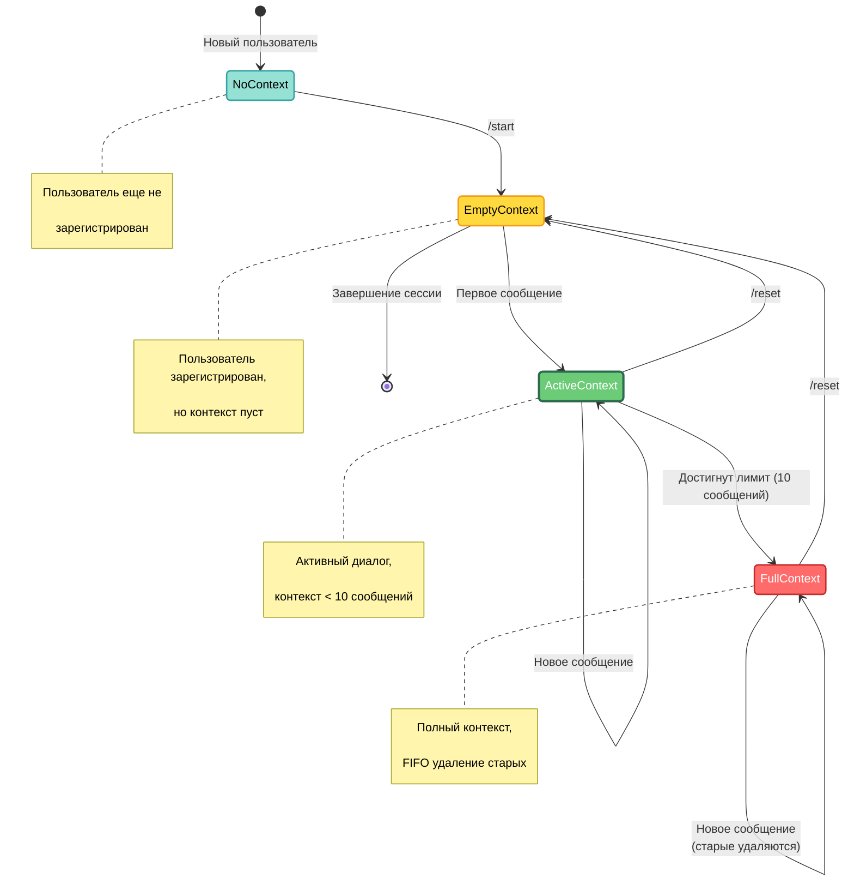
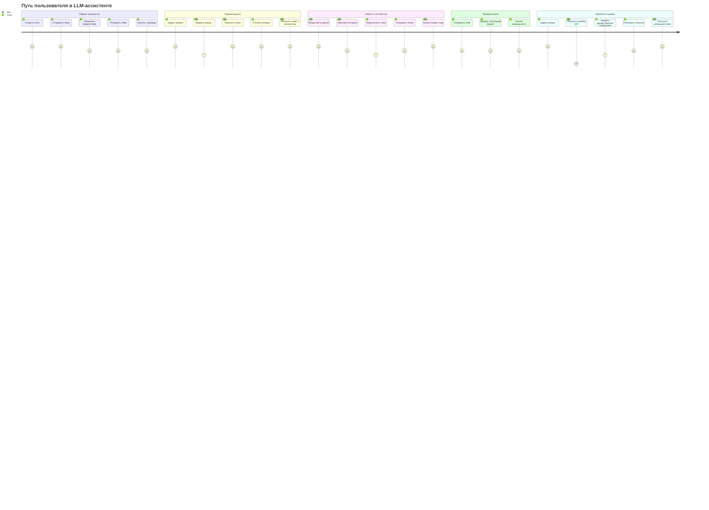
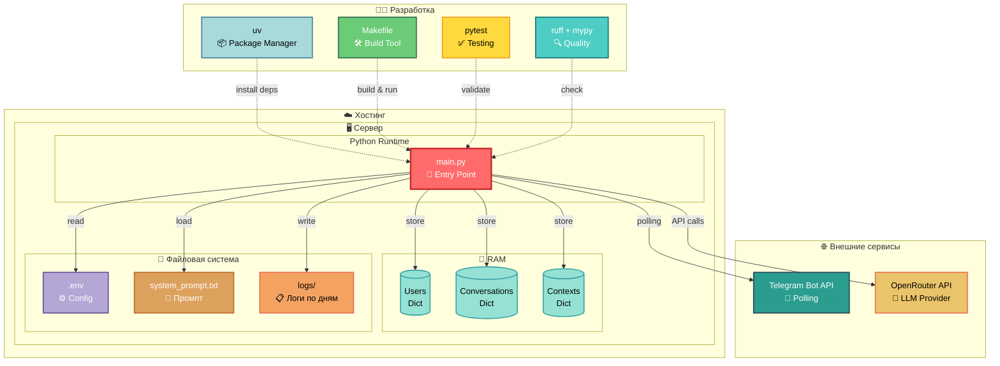
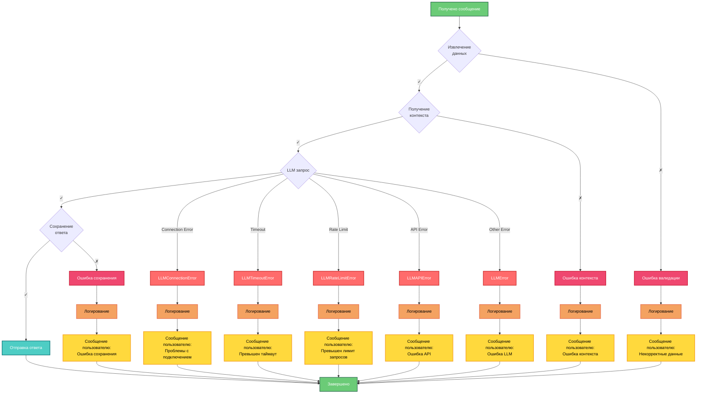

# 05. Визуальная архитектура проекта

> **Навигация**: [← Назад к обзору кодовой базы](04-codebase-tour.md) | [Главная](README.md) | [Далее: Процесс разработки →](08-development-workflow.md)

---

Этот документ представляет визуализацию проекта LLM-ассистента с различных точек зрения, используя разнообразные диаграммы для понимания архитектуры, потоков данных, взаимодействий и сценариев использования.

## Содержание

1. [Компонентная архитектура](#1-компонентная-архитектура)
2. [Поток данных](#2-поток-данных)
3. [Последовательность взаимодействий](#3-последовательность-взаимодействий)
4. [Диаграмма классов](#4-диаграмма-классов)
5. [Машина состояний](#5-машина-состояний)
6. [Путь пользователя](#6-путь-пользователя)
7. [Развертывание](#7-развертывание)
8. [Обработка ошибок](#8-обработка-ошибок)

---

## 1. Компонентная архитектура

Высокоуровневое представление компонентов системы и их взаимодействия:



### Описание компонентов:

- **TelegramBot** - точка входа, управление polling и регистрация handlers
- **MessageHandler** - главный координатор обработки сообщений
- **OpenAIClient** - асинхронное взаимодействие с LLM API
- **ContextManager** - управление историей диалога в памяти
- **MemoryStorage** - хранение пользователей и сообщений
- **MessageExtractor** - извлечение данных из Telegram сообщений
- **BotMessages** - константы текстовых сообщений
- **Settings** - конфигурация и валидация параметров
- **Models** - модели данных (User, Message, Conversation)
- **Exceptions** - кастомные исключения для LLM ошибок

---

## 2. Поток данных

Визуализация потока данных от получения сообщения до отправки ответа:

```mermaid
flowchart LR
    User([👤 Пользователь])

    subgraph Input["📥 Получение"]
        TG_IN[Telegram API]
        BOT[TelegramBot]
    end

    subgraph Process["⚙️ Обработка"]
        EXTRACT[MessageExtractor<br/>📝 Извлечение]
        HANDLER[MessageHandler<br/>🎯 Координация]

        subgraph Context["💭 Управление контекстом"]
            CTX_GET[Получить историю]
            CTX_ADD[Добавить сообщение]
        end

        subgraph Storage["💾 Хранилище"]
            SAVE_USER[Сохранить<br/>пользователя]
            SAVE_MSG[Сохранить<br/>сообщение]
        end

        LLM[OpenAIClient<br/>🤖 LLM Request]
    end

    subgraph Output["📤 Отправка"]
        RESPONSE[Ответ LLM]
        TG_OUT[Telegram API]
    end

    User -->|текст| TG_IN
    TG_IN -->|Message| BOT
    BOT -->|Message| HANDLER
    HANDLER -->|Message| EXTRACT
    EXTRACT -->|MessageContext| HANDLER
    HANDLER -->|user_id| SAVE_USER
    HANDLER -->|user_id| CTX_GET
    CTX_GET -->|messages[]| HANDLER
    HANDLER -->|messages + prompt| LLM
    LLM -->|response| HANDLER
    HANDLER -->|user_id, response| CTX_ADD
    HANDLER -->|message| SAVE_MSG
    HANDLER -->|response| RESPONSE
    RESPONSE -->|text| TG_OUT
    TG_OUT -->|ответ| User

    style User fill:#FF6B6B,stroke:#C92A2A,stroke-width:3px,color:#fff
    style BOT fill:#4ECDC4,stroke:#0D7377,stroke-width:2px,color:#fff
    style HANDLER fill:#FFD93D,stroke:#F49D1A,stroke-width:3px,color:#000
    style EXTRACT fill:#A8DADC,stroke:#457B9D,stroke-width:2px,color:#000
    style LLM fill:#E9C46A,stroke:#E76F51,stroke-width:2px,color:#000
    style CTX_GET fill:#6BCB77,stroke:#2D6A4F,stroke-width:2px,color:#fff
    style CTX_ADD fill:#6BCB77,stroke:#2D6A4F,stroke-width:2px,color:#fff
    style SAVE_USER fill:#95E1D3,stroke:#38A3A5,stroke-width:2px,color:#000
    style SAVE_MSG fill:#95E1D3,stroke:#38A3A5,stroke-width:2px,color:#000
    style RESPONSE fill:#B4A7D6,stroke:#6A4C93,stroke-width:2px,color:#fff
    style TG_IN fill:#2A9D8F,stroke:#264653,stroke-width:2px,color:#fff
    style TG_OUT fill:#2A9D8F,stroke:#264653,stroke-width:2px,color:#fff
```

### Ключевые этапы потока:

1. **Получение** - Telegram API → TelegramBot → MessageHandler
2. **Извлечение** - MessageExtractor создает MessageContext
3. **Контекст** - ContextManager предоставляет историю диалога
4. **LLM** - OpenAIClient отправляет запрос к AI модели
5. **Сохранение** - Обновление контекста и хранилища
6. **Отправка** - Ответ пользователю через Telegram API

---

## 3. Последовательность взаимодействий

Детальная последовательность обработки текстового сообщения:



### Этапы взаимодействия:

1. **Получение сообщения** - от пользователя через Telegram API
2. **Извлечение данных** - MessageExtractor создает контекст
3. **Управление пользователем** - создание/обновление в MemoryStorage
4. **Получение истории** - ContextManager → MemoryStorage
5. **LLM запрос** - OpenAIClient → LLM API (async)
6. **Сохранение ответа** - обновление контекста и хранилища
7. **Отправка ответа** - пользователю через Telegram API

---

## 4. Диаграмма классов

Структура классов и их отношения:



### Ключевые аспекты архитектуры классов:

- **Dependency Injection** - все зависимости передаются через конструктор
- **Single Responsibility** - каждый класс отвечает за одну задачу
- **1 класс = 1 файл** - строгое соблюдение принципа
- **Dataclasses** - для моделей данных (User, Message, Conversation)
- **Utility classes** - статические методы (MessageExtractor)
- **Constants classes** - для текстовых сообщений (BotMessages)

---

## 5. Машина состояний

Состояния контекста диалога пользователя:



### Описание состояний:

- **NoContext** - пользователь не существует в системе
- **EmptyContext** - пользователь зарегистрирован, но история пуста
- **ActiveContext** - активный диалог с историей < 10 сообщений
- **FullContext** - полный контекст, новые сообщения вытесняют старые (FIFO)

### Триггеры переходов:

- `/start` - регистрация пользователя
- Текстовое сообщение - добавление в контекст
- `/reset` - очистка истории
- Достижение лимита - переход в режим FIFO

---

## 6. Путь пользователя

Визуализация пользовательских сценариев:



### Основные сценарии:

1. **Онбординг** - `/start`, `/help`, знакомство с ботом
2. **Диалог** - текстовые сообщения, контекстные ответы
3. **Управление контекстом** - `/reset` для новой темы
4. **Проверка роли** - `/role` для понимания возможностей
5. **Обработка ошибок** - graceful degradation при проблемах с API

---

## 7. Развертывание

Архитектура развертывания и зависимости:



### Компоненты развертывания:

**Runtime:**
- Python 3.11+ с asyncio
- Единая точка входа `main.py`

**In-Memory Storage:**
- Users - словарь пользователей
- Conversations - история диалогов
- Contexts - контекст для LLM

**File System:**
- `.env` - конфигурация (токены, API keys)
- `system_prompt.txt` - роль ассистента
- `logs/` - структурированные логи по дням

**External Services:**
- Telegram Bot API (polling режим)
- OpenRouter API (LLM провайдер)

**Development Tools:**
- `uv` - управление зависимостями
- `make` - автоматизация задач
- `pytest` - тестирование (98%+ coverage)
- `ruff + mypy` - качество кода

---

## 8. Обработка ошибок

Поток обработки ошибок и recovery сценарии:



### Типы ошибок и обработка:

**LLM Ошибки:**
- `LLMConnectionError` - проблемы с подключением к API
- `LLMTimeoutError` - превышен таймаут запроса
- `LLMRateLimitError` - превышен лимит запросов
- `LLMAPIError` - общая ошибка API
- `LLMError` - базовый класс для всех LLM ошибок

**Принципы обработки:**
1. **Graceful degradation** - система продолжает работать
2. **Локальное логирование** - все ошибки записываются в лог
3. **Дружественные сообщения** - понятные уведомления пользователю
4. **Fail fast** - быстрое обнаружение проблем
5. **Re-raise** - пробрасывание для обработки на верхнем уровне

---

## Заключение

Эти диаграммы представляют различные аспекты архитектуры LLM-ассистента:

- **Компонентная архитектура** - структура и взаимодействие компонентов
- **Поток данных** - путь сообщения от пользователя к ответу
- **Последовательность** - детальное взаимодействие между компонентами
- **Классы** - объектно-ориентированная структура
- **Состояния** - управление контекстом диалога
- **User Journey** - пользовательский опыт
- **Развертывание** - инфраструктура и зависимости
- **Ошибки** - обработка исключительных ситуаций

### Ключевые принципы архитектуры:

✅ **KISS** - максимальная простота
✅ **SOLID** - правильное разделение ответственности
✅ **DRY** - избегание дублирования кода
✅ **Async/Await** - неблокирующие операции
✅ **Fail Fast** - быстрое обнаружение ошибок
✅ **In-Memory** - хранение данных в RAM
✅ **1 класс = 1 файл** - понятная структура

---

> **Навигация**: [← Назад к обзору кодовой базы](04-codebase-tour.md) | [Главная](README.md) | [Далее: Процесс разработки →](08-development-workflow.md)

