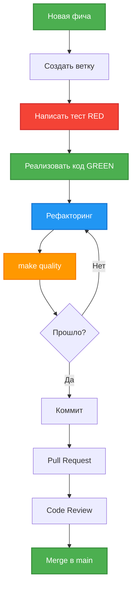
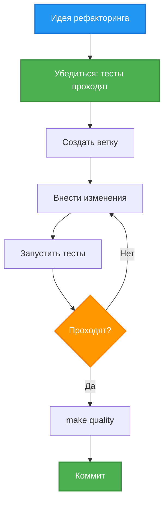
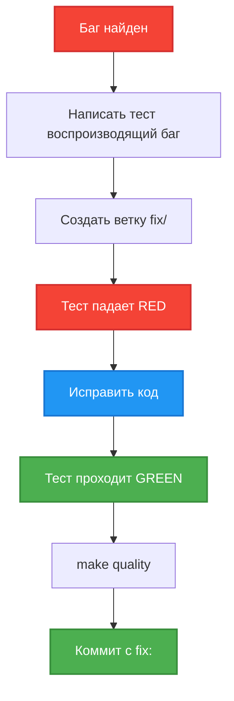

# 🔄 Development Workflow

Процесс разработки в проекте за 30 минут.

## Принципы разработки

### KISS (Keep It Simple, Stupid)
Простота важнее сложности. Нет оверинжиниринга.

### TDD (Test-Driven Development)
**Red → Green → Refactor**
1. Напиши падающий тест
2. Реализуй минимальный код для прохождения
3. Улучши код

### SOLID принципы
- **Single Responsibility** - один класс = одна задача
- **Open/Closed** - открыт для расширения, закрыт для изменения
- **Dependency Inversion** - зависимость от абстракций через DI

### DRY (Don't Repeat Yourself)
Нет дублирования кода. Общая логика - в отдельные классы.

### 1 класс = 1 файл
Строгое соблюдение. Исключений нет.

## Workflow добавления фичи



## Шаг 1: Создание ветки

```bash
# Обновить main
git checkout main
git pull origin main

# Создать feature ветку
git checkout -b feature/add-user-statistics

# Или bugfix ветку
git checkout -b fix/handle-empty-messages
```

**Именование веток:**
- `feature/` - новая фича
- `fix/` - исправление бага
- `refactor/` - рефакторинг
- `docs/` - документация

## Шаг 2: TDD цикл

### Red - Напиши падающий тест

**Пример:** Добавляем статистику пользователей

```python
# tests/test_memory_storage.py

@pytest.mark.unit
def test_get_user_statistics():
    """Тест получения статистики пользователя"""
    storage = MemoryStorage()

    # Создаем пользователя и сообщения
    user = storage.create_user(123, "john", "John")

    # Добавляем 5 сообщений
    for i in range(5):
        storage.save_conversation(...)

    # Проверяем статистику
    stats = storage.get_user_statistics(123)
    assert stats.message_count == 5
    assert stats.user_id == 123
```

**Запускаем тест:**
```bash
make test
# FAILED - метод get_user_statistics не существует ✅ (это ожидаемо)
```

### Green - Минимальная реализация

```python
# src/memory_storage.py

def get_user_statistics(self, user_id: int) -> dict:
    """Получить статистику пользователя"""
    user = self._users.get(user_id)
    if not user:
        return {"user_id": user_id, "message_count": 0}

    # Подсчитать сообщения
    conversation = self._conversations.get(user_id)
    message_count = len(conversation.messages) if conversation else 0

    return {
        "user_id": user_id,
        "message_count": message_count,
    }
```

**Запускаем тест:**
```bash
make test
# PASSED ✅
```

### Refactor - Улучшаем код

```python
# src/models.py - создаем модель

@dataclass
class UserStatistics:
    user_id: int
    message_count: int
    created_at: datetime
    last_activity: datetime

# src/memory_storage.py - используем модель

def get_user_statistics(self, user_id: int) -> Optional[UserStatistics]:
    """Получить статистику пользователя"""
    user = self._users.get(user_id)
    if not user:
        return None

    conversation = self._conversations.get(user_id)
    message_count = len(conversation.messages) if conversation else 0

    return UserStatistics(
        user_id=user.user_id,
        message_count=message_count,
        created_at=user.created_at,
        last_activity=user.last_activity,
    )
```

**Обновляем тест:**
```python
stats = storage.get_user_statistics(123)
assert stats.message_count == 5
assert stats.user_id == 123
assert isinstance(stats, UserStatistics)
```

**Запускаем тесты:**
```bash
make test
# PASSED ✅
```

## Шаг 3: Проверка качества

```bash
# Полная проверка
make quality
```

Это выполнит:
1. **Format** - автоформатирование (ruff format)
2. **Lint** - проверка линтером (ruff check)
3. **Type-check** - проверка типов (mypy strict)
4. **Test-cov** - тесты с покрытием (pytest)

**Требования:**
- ✅ 0 ошибок форматирования
- ✅ 0 ошибок линтера
- ✅ 0 ошибок типизации
- ✅ Все тесты проходят
- ✅ Coverage >= 95%

### Что делать если не проходит?

**Ошибки форматирования:**
```bash
make format  # Автоисправление
```

**Ошибки линтера:**
```bash
make lint
# Читаем ошибки и исправляем
```

**Ошибки типизации:**
```bash
make type-check
# Добавляем type hints
```

**Тесты падают:**
```bash
make test -v
# Читаем вывод и исправляем
```

**Низкое покрытие:**
```bash
make test-cov
# Смотрим какие строки не покрыты
# Добавляем тесты
```

## Шаг 4: Коммит изменений

### Структура коммита

```bash
git add src/memory_storage.py src/models.py tests/test_memory_storage.py
git commit -m "feat: add user statistics

- Добавлен метод get_user_statistics в MemoryStorage
- Создана модель UserStatistics
- Добавлены тесты для статистики
- Coverage: 98%"
```

**Формат сообщения:**
```
<type>: <краткое описание>

<детальное описание>
- что сделано
- зачем
- coverage
```

**Типы коммитов:**
- `feat:` - новая фича
- `fix:` - исправление бага
- `refactor:` - рефакторинг
- `test:` - добавление тестов
- `docs:` - документация
- `style:` - форматирование

### Пример хорошего коммита

```bash
git commit -m "feat: add user statistics endpoint

Добавлена возможность получения статистики пользователя:
- UserStatistics модель с полями user_id, message_count, created_at
- MemoryStorage.get_user_statistics() метод
- 5 unit тестов покрывают все случаи
- Обновлена документация в README.md

Coverage: 98.5%"
```

### Пример плохого коммита

```bash
# ❌ Плохо
git commit -m "fixes"

# ❌ Плохо
git commit -m "added stuff"

# ❌ Плохо
git commit -m "WIP"
```

## Шаг 5: Push и Pull Request

```bash
# Push ветки
git push origin feature/add-user-statistics

# Создать PR в GitHub
```

### Описание PR

**Заголовок:** `feat: Add user statistics`

**Описание:**
```markdown
## Что сделано
- Добавлена модель UserStatistics
- Реализован метод get_user_statistics в MemoryStorage
- Добавлены unit тесты (5 тестов)

## Зачем
Нужна статистика пользователей для мониторинга активности.

## Тестирование
- ✅ make quality проходит
- ✅ Coverage: 98.5%
- ✅ Все 126 тестов проходят

## Чеклист
- [x] Тесты написаны
- [x] Coverage >= 95%
- [x] make quality проходит
- [x] Документация обновлена
```

## Workflow рефакторинга



### Принципы рефакторинга

1. **Тесты должны проходить** перед началом
2. **Маленькие шаги** - не рефакторь все сразу
3. **Тесты после каждого шага** - убедись что не сломал
4. **Один коммит = один рефакторинг**

### Пример рефакторинга

**Было:** Дублирование извлечения данных
```python
# В message_handler.py (повторялось 5 раз)
user_id = message.from_user.id
username = message.from_user.username
first_name = message.from_user.first_name
```

**Стало:** Выделен MessageExtractor
```python
# src/message_extractor.py
context = MessageExtractor.extract(message)
user_id = context.user_id
```

**Коммит:**
```bash
git commit -m "refactor: extract message data extraction to MessageExtractor

- Создан MessageExtractor класс для извлечения данных
- Устранено дублирование кода в MessageHandler
- Добавлены 5 unit тестов для MessageExtractor
- MessageHandler упрощен (-33 строки)

Coverage: 98%"
```

## Workflow исправления бага



### Пример исправления бага

**Баг:** Бот падает если username = None

1. **Создаем ветку:**
```bash
git checkout -b fix/handle-none-username
```

2. **Пишем тест воспроизводящий баг:**
```python
@pytest.mark.unit
def test_extract_message_without_username():
    """Тест извлечения данных когда username = None"""
    message = Mock()
    message.from_user.id = 123
    message.from_user.username = None  # Баг: здесь None
    message.from_user.first_name = "John"

    context = MessageExtractor.extract(message)
    assert context.username is None  # Не должно упасть
    assert context.user_id == 123
```

3. **Запускаем тест (падает):**
```bash
make test
# FAILED - AttributeError ❌
```

4. **Исправляем код:**
```python
# src/message_extractor.py
@staticmethod
def extract(message) -> MessageContext:
    return MessageContext(
        user_id=message.from_user.id,
        username=message.from_user.username or None,  # Обработка None
        first_name=message.from_user.first_name,
        ...
    )
```

5. **Запускаем тест (проходит):**
```bash
make test
# PASSED ✅
```

6. **Проверяем качество:**
```bash
make quality
# ✅ Все проверки прошли
```

7. **Коммитим:**
```bash
git commit -m "fix: handle None username in MessageExtractor

Баг: бот падал с AttributeError когда username = None

Исправление:
- Добавлена проверка на None в MessageExtractor.extract()
- Добавлен тест test_extract_message_without_username
- Теперь None обрабатывается корректно

Coverage: 98%"
```

## Git workflow

### Ветки

```
main (production)
├── feature/add-user-stats
├── feature/add-export
├── fix/handle-none-username
└── refactor/simplify-handler
```

**Правила:**
- `main` - всегда стабильная
- Фичи в отдельных ветках
- PR перед мержем в main
- Code review обязателен

### Команды

```bash
# Создать ветку
git checkout -b feature/my-feature

# Посмотреть изменения
git status
git diff

# Добавить файлы
git add src/file.py tests/test_file.py

# Коммит
git commit -m "feat: add feature"

# Push
git push origin feature/my-feature

# Обновить main
git checkout main
git pull origin main

# Merge main в feature (если нужно)
git checkout feature/my-feature
git merge main
```

## Чеклист перед коммитом

**Обязательно:**
- [ ] Тесты написаны
- [ ] Тесты проходят (`make test`)
- [ ] Coverage >= 95% (`make test-cov`)
- [ ] Линтер проходит (`make lint`)
- [ ] Типы проверены (`make type-check`)
- [ ] Код отформатирован (`make format`)
- [ ] `make quality` проходит без ошибок

**Желательно:**
- [ ] Документация обновлена (если нужно)
- [ ] README обновлен (если нужно)
- [ ] Примеры добавлены (если нужно)
- [ ] Логирование добавлено (для важных операций)

## Workspace Rules

Проект использует **Cursor Workspace Rules** для автоматической проверки.

**Локация:** `.cursor/rules/`

**Основные правила:**
- 1 класс = 1 файл
- Type hints везде
- KISS, SOLID, DRY
- TDD подход
- Coverage >= 95%

**Как использовать:**
Cursor автоматически применяет правила при работе с кодом.

## Полезные команды

```bash
# Разработка
make install-dev     # Установить dev зависимости
make run             # Запустить бота

# Тестирование
make test            # Все тесты
make test-unit       # Только unit
make test-integration # Только integration
make test-property   # Только property-based
make test-cov        # С покрытием

# Качество
make format          # Автоформатирование
make lint            # Проверка линтером
make type-check      # Проверка типов
make quality         # Полная проверка (обязательно перед коммитом!)

# Очистка
make clean           # Удалить кэш и временные файлы
```

## Что дальше?

✅ **Вы знаете процесс разработки**

Следующий шаг:
1. [Testing Guide](09-testing-guide.md) - детали тестирования

---

**Время выполнения: 30 минут**

