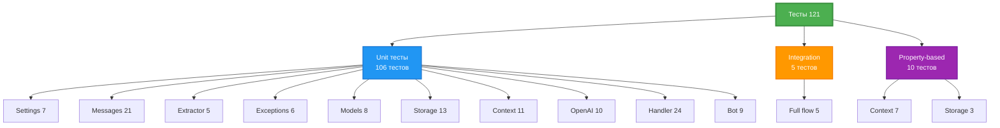

# 🧪 Testing Guide

Гайд по тестированию в проекте за 30 минут.

## Философия тестирования

### TDD (Test-Driven Development)
**Red → Green → Refactor**

### Что тестируем
✅ **Бизнес-логика** - критичные сценарии
✅ **Граничные случаи** - ошибки, edge cases
✅ **Интеграции** - взаимодействие компонентов

### Что НЕ тестируем
❌ **Getters/setters** без логики
❌ **Тривиальные конструкторы**
❌ **Framework код** (aiogram, openai)
❌ **Константы** (простые dataclass)

## Структура тестов

### Текущее покрытие

121 тест, 98% coverage, ~15 секунд

- Unit тесты (90%): 106 тестов
- Integration тесты (5-10%): 5 тестов
- Property-based тесты (<5%): 10 тестов

### Категории тестов

### Pytest маркеры

- `@pytest.mark.unit` - Изолированное тестирование класса
- `@pytest.mark.integration` - Взаимодействие реальных компонентов
- `@pytest.mark.property` - Property-based с Hypothesis

## Запуск тестов

### Команды

**Все тесты:**
- `make test` - запуск всех тестов

**По категориям:**
- `make test-unit` - только unit (106 тестов)
- `make test-integration` - только integration (5 тестов)
- `make test-property` - только property-based (10 тестов)

**С покрытием:**
- `make test-cov` - все тесты с отчетом coverage

**Конкретные тесты:**
- `uv run pytest tests/test_memory_storage.py -v` - конкретный файл
- `uv run pytest tests/test_memory_storage.py::test_create_user -v` - конкретный тест

### Вывод тестов

Тесты показывают статус каждого теста (PASSED/FAILED) с процентом выполнения и итоговую статистику с временем выполнения и coverage.

## Написание тестов

### AAA паттерн

**Arrange → Act → Assert**

Структура каждого теста:
1. **Arrange** - подготовка (создание моков, данных, зависимостей)
2. **Act** - действие (вызов тестируемого метода)
3. **Assert** - проверка (assert результатов и verify моков)

### Именование тестов

**Формат:** `test_<метод>_<условие>_<результат>`

Примеры названий:
- `test_handle_start_command()` - базовый случай
- `test_handle_start_without_user()` - edge case
- `test_handle_text_message_llm_error()` - error case
- `test_reset_clears_all_components()` - integration
- `test_context_never_exceeds_max_messages()` - property

## Unit тесты (90%)

### Принципы
- Изолированное тестирование одного класса
- Все зависимости замокированы
- Проверяем поведение, не реализацию

### Пример unit теста

**Структура:**
1. Создаем моки всех зависимостей (AsyncMock для async, Mock для sync)
2. Указываем spec= для type safety
3. Настраиваем return_value для моков
4. Создаем экземпляр тестируемого класса с моками
5. Создаем тестовые данные (например, mock сообщения)
6. Вызываем тестируемый метод
7. Проверяем вызовы моков (assert_called_once, assert_called_with)
8. Проверяем результаты и изменения состояния

### Моки

#### Mock vs AsyncMock

**Правила:**
- Используйте `Mock` для синхронных методов
- Используйте `AsyncMock` для async методов (обязательно!)
- Всегда указывайте `spec=` для type safety

#### spec= для type safety

Всегда используйте `spec=ClassName` при создании моков для предотвращения опечаток и ошибок типизации.

### Fixtures для переиспользования

Fixtures позволяют переиспользовать setup код между тестами:
- Создайте fixture с декоратором `@pytest.fixture`
- Верните объект из fixture
- Используйте имя fixture как параметр теста
- pytest автоматически вызовет fixture и передаст результат

### Parametrize для вариантов

Декоратор `@pytest.mark.parametrize` позволяет запустить один тест с разными наборами данных:
- Определите параметры и их значения
- Pytest создаст отдельный тест для каждой комбинации
- Удобно для тестирования разных типов ошибок, граничных значений и вариантов поведения

## Integration тесты (5-10%)

### Принципы
- Реальные внутренние компоненты (ContextManager, MemoryStorage)
- Моки только для внешних API (OpenAI, Telegram)
- Проверяем полный поток от начала до конца

### Пример integration теста

**Структура:**
1. Создаем реальные экземпляры внутренних компонентов (ContextManager, MemoryStorage)
2. Мокируем только внешние API (OpenAI)
3. Создаем handler с реальными и мок-зависимостями
4. Выполняем полный поток обработки
5. Проверяем состояние всех компонентов:
   - Сообщения в storage
   - Контекст в context_manager
   - Вызовы внешних API
   - Ответы пользователю

### Тест команды /reset

Проверяет что команда `/reset` корректно очищает весь контекст во всех компонентах системы.

## Property-based тесты (<5%)

### Что такое property-based?

Проверка **инвариантов** (неизменных правил) на случайно сгенерированных данных с помощью библиотеки Hypothesis.

### Hypothesis

Hypothesis генерирует случайные данные (integers, strings, lists) и проверяет что инварианты соблюдаются для всех сгенерированных значений.

**Декоратор `@given`:**
- Определяет стратегии генерации данных
- Hypothesis автоматически создает тестовые случаи
- При нахождении ошибки Hypothesis минимизирует пример
- Запускает тест с разными комбинациями параметров

### Когда использовать?

✅ **Использовать для:**
- Критичных компонентов (ContextManager, Storage)
- Проверки граничных случаев
- Математических/структурных свойств

❌ **НЕ использовать для:**
- Простых CRUD операций
- UI логики
- Внешних API

### Примеры инвариантов

Типичные проверяемые инварианты:
- Контекст никогда не превышает max_messages
- Сообщения всегда упорядочены по времени
- Роли чередуются между user и assistant
- Storage не теряет данные при добавлении

## Тестирование ошибок

### Try-except в тестах

Используйте `pytest.raises` для проверки что метод бросает правильное исключение:
- Мокируйте метод с side_effect=Exception
- Оборачивайте вызов в `with pytest.raises(ExceptionType)`
- Проверяйте сообщение исключения при необходимости

### side_effect для моков

`side_effect` позволяет мокам выполнять разные действия:
- Бросить исключение: `mock.side_effect = Exception("Error")`
- Вернуть разные значения: `mock.side_effect = ["first", "second"]`
- Выполнить функцию: `mock.side_effect = lambda x: x * 2`

## Async тестирование

### Правила async тестов

**Обязательные требования:**
- Используйте `async def` для async тестов
- Используйте `AsyncMock` для async методов (не `Mock`!)
- Используйте `await` при вызове async методов
- Проверяйте вызовы через `assert_called_once()`, `assert_called_with()`
- Опционально: `assert_awaited_once()` для явной проверки await

### AsyncMock обязателен!

**Правило:** Всегда используйте `AsyncMock` для мокирования async методов, иначе тест упадет при попытке await.

## Coverage

### Требования

- **Минимум:** 95%
- **Цель:** 98%+
- **Текущий:** 98.12%

### Исключения из coverage

Из coverage исключены файлы `src/main.py` и `src/telegram_bot.py` т.к. это entry points которые тестируются integration тестами.

### Проверка coverage

Команда `make test-cov` показывает процент покрытия и список непокрытых строк.

### Как улучшить coverage

Процесс улучшения coverage:
1. Запустите `make test-cov`
2. Найдите непокрытые строки в отчете
3. Напишите тесты для этих строк (обычно это edge cases или error handling)
4. Повторите проверку

## Чеклист хорошего теста

**Обязательно:**
- [ ] Имеет pytest маркер (`@pytest.mark.unit`)
- [ ] Понятное имя (`test_method_condition_result`)
- [ ] AAA структура (Arrange, Act, Assert)
- [ ] Тестирует одну вещь
- [ ] Использует правильные моки (Mock/AsyncMock)
- [ ] Проверяет важное поведение

**Желательно:**
- [ ] Использует fixtures для setup
- [ ] Использует parametrize для вариантов
- [ ] Имеет docstring
- [ ] Проверяет вызовы зависимостей
- [ ] Проверяет edge cases

## Антипаттерны

### ❌ Избыточное тестирование

**Плохо:** Тестирование простых конструкторов и присваиваний без логики - это бессмысленно и не добавляет ценности.

### ❌ Тесты с логикой

**Плохо:** Использование if/else/for в тестах делает их сложными и подверженными ошибкам.
**Хорошо:** Используйте `@pytest.mark.parametrize` для разных вариантов вместо условной логики.

### ❌ Хрупкие тесты

**Плохо:** Сравнение полных словарей/объектов может сломаться при изменении порядка или добавлении полей.
**Хорошо:** Проверяйте конкретные значения по ключам, важные для теста.

### ❌ Дублирование setup

**Плохо:** Копирование одинакового setup кода в каждый тест.
**Хорошо:** Вынесите общий setup в `@pytest.fixture` и переиспользуйте между тестами.

## Примеры из проекта

### Unit тест для MemoryStorage

Тест проверяет создание пользователя и его получение из storage. Использует реальный MemoryStorage без моков, проверяет что пользователь корректно сохранен и извлечен.

### Integration тест полного flow

Тест проверяет полный поток: получение сообщения → обработка → вызов LLM → сохранение → ответ. Использует реальные ContextManager и MemoryStorage, мокирует только OpenAI API. Проверяет состояние всех компонентов после обработки.

### Property-based тест

Тест проверяет что storage никогда не теряет пользователей независимо от количества добавленных пользователей (сгенерированного Hypothesis).

## Полезные команды

**Запуск тестов:**
- `make test` - все тесты
- `make test-unit` - только unit
- `make test-integration` - только integration
- `make test-property` - только property-based
- `make test-cov` - с покрытием

**Конкретные тесты:**
- `uv run pytest tests/test_memory_storage.py -v` - конкретный файл
- `uv run pytest tests/test_memory_storage.py::test_create_user -v` - конкретный тест

**Дополнительные опции:**
- `uv run pytest -s` - с выводом print
- `uv run pytest -x` - остановиться на первом падении
- `uv run pytest --lf` - запустить последние упавшие

## Что дальше?

✅ **Вы знаете как писать и запускать тесты**

Начинайте разрабатывать:
1. Напишите тест (Red)
2. Реализуйте код (Green)
3. Улучшите код (Refactor)
4. Запустите `make quality`

---

**Время выполнения: 30 минут**
